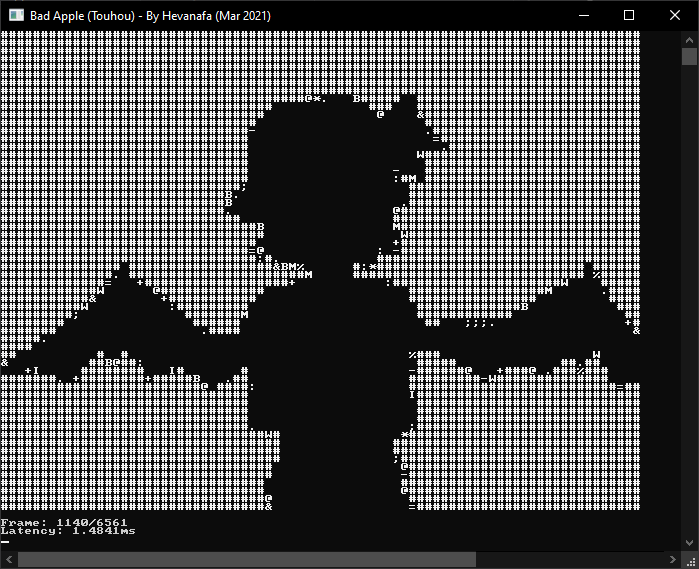
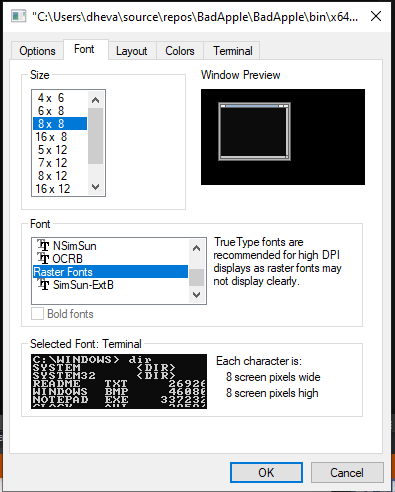

# Bad Apple (Touhou) but it's a C# Console Application

By Hevanafa (Mar 2021)

# Things to do Before Running
1. Change your default Console font to 8x8 or anything else that fits your screen:

2. Start the debugger so it creates the debug folder automatically,

3. Stop the debugger,

4. Extract `img_20fps_60.7z` into the debug folder (leave the folder name as it is),

5. Start the debugger again and enjoy!
